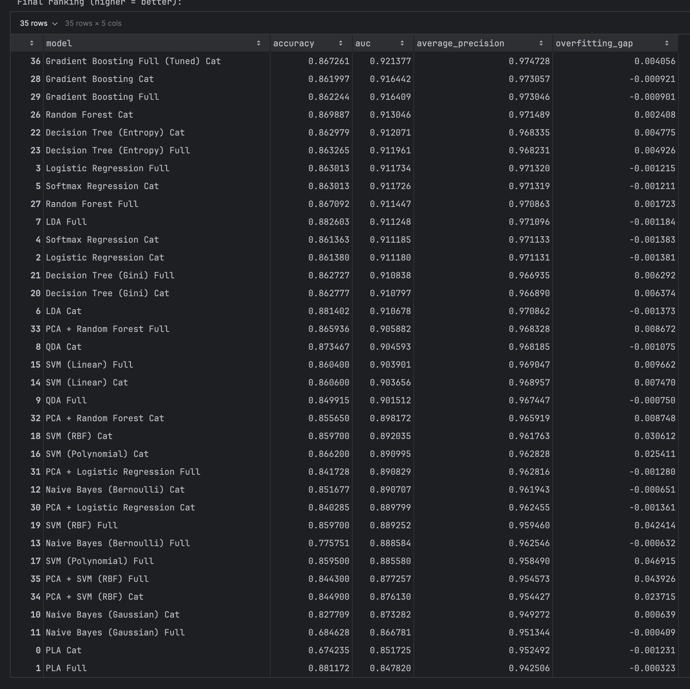

# Kaggle Playground S5E11: Predicting Loan Payback
CMPT 311 Machine Learning (Fall 2025) - Final Project

**Student Name:** Makenna Worley

**Kaggle Episode:** Season 5, Episode 11

**Competition Link:** [Predicting Loan Payback](https://www.kaggle.com/competitions/playground-series-s5e11)

---

## 1. Project Overview
This repository contains the final capstone project for **CMPT 311 Machine Learning**. The objective was to compete in a Kaggle playground episode and build a complete machine learning pipeline to predict the probability that a borrower will pay back a loan (Binary Classification).

**The Challenge:**
Using a synthetic dataset generated from real-world loan data, the goal is to predict the target variable `loan_paid_back` (0 or 1).

## 2. Repository Structure & File Guide

The project is divided into two phases of development, consistent with the course and Kaggle rules:

```
├── data/                       # Dataset files (can be downloaded from Kaggle)
├── submissions/                # Submission files
├── s5e11.ipynb                 # PHASE 1: Initial Experimentation (Sandbox)
│                               # - Contains code for first submission on Kaggle
│                               # - my "Bare minimum" baseline implementation
│
├── s5e11 v2.ipynb              # PHASE 2: Final Project (Presentation Code)
│                               # - Extensive Model Comparison (SVM, PLA, RF, GB, etc.)
│                               # - PCA & Dimensionality Reduction experiments
│                               # - Final Visualizations & Evaluation
│
├── s5e11 v3.ipynb              # PHASE 3: More Experimentation (Beyond Class Scope)
│
├── presentation.pdf            # Final presentation slides
└── README.md                   # Project documentation
```

## 3. Data Understanding & EDA

The dataset consists of approximately 25,011 rows with a mix of numerical and categorical features.

- Target Variable: `loan_paid_back` (Binary Classification)
- Key Features: `annual_income`, `debt_to_income_ratio`, `credit_score`, `loan_amount`, `interest_rate`.
- Distributions: Analyzed via histograms and countplots (available in the notebook).
- Correlations: Numerical pairwise relationships were examined to check for multicollinearity.

## 4. Methodology

Preprocessing
- Encoding: Categorical variables (`gender`, `marital_status`) were transformed using One-Hot Encoding (`pd.get_dummies`).
- Scaling: Numerical features were standardized using `StandardScaler` to ensure optimal performance for distance-based algorithms like SVM.
- Dimensionality Reduction: Principal Component Analysis (PCA) was tested to reduce feature space and improve training time.

Model Comparison

I implemented and compared a wide range of classifiers, moving from simple linear models to complex ensembles:
- Logistic Regression: Used as a robust baseline.
- Naive Bayes: Tested both Gaussian and Bernoulli variants.
- Perceptron (PLA): Tested for linear separability.
- Support Vector Machines (SVM):Optimization Strategy: Due to SVM's time complexity of $O(n^3)$, I utilized a stratified "Mini" dataset (10k samples) to tune Linear, Polynomial, and RBF kernels efficiently.
- Random Forest: Ensemble bagging method.
- Gradient Boosting: Boosting method for maximizing predictive performance.

## 5. Results & Evaluation

Models were evaluated based on Accuracy, ROC-AUC, and Average Precision. I also implemented an automated check for overfitting (comparing Train vs. Test accuracy).



Key Findings:

- Gradient Boosting yielded the best performance (AUC: 0.916), successfully capturing non-linear relationships in the loan data.
- Logistic Regression performed surprisingly well, suggesting a strong linear component in the feature space.
- PCA generally reduced performance slightly but offered significant speed improvements.

Visualizations including ROC Curves and Precision-Recall Curves for all models can be found in the final notebook.
